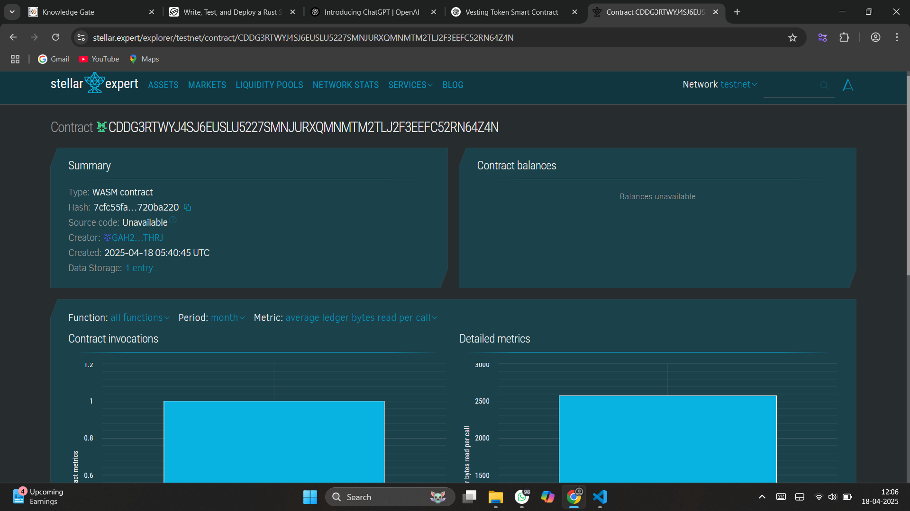

# Vesting Token Contract

## Project Description

The **Vesting Token Contract** is a smart contract written using the `soroban-sdk` that enables controlled, time-based token vesting for beneficiaries. This contract ensures that tokens are released according to a pre-defined schedule, minimizing risks related to early liquidation or unfair distribution.

## Project Vision

To provide a secure, transparent, and decentralized method for vesting tokens to team members, partners, and stakeholders in a blockchain-based ecosystem. The contract aims to support fair distribution and long-term alignment of incentives within token-based projects.

## Key Features

- **Create Vesting Schedule**  
  Allows an admin or token distributor to set up a vesting schedule for a beneficiary, including total amount and duration.

- **Claim Vested Tokens**  
  Beneficiaries can claim their unlocked (vested) tokens based on the time elapsed and their vesting schedule.

- **View Vesting Status**  
  Anyone can query the current vesting status, total tokens vested, and tokens claimed for a specific beneficiary.

- **Cancel Vesting (Optional)**  
  Admin can cancel unvested allocations in specific conditions (e.g., early termination or non-compliance).

## Future Scope

- **Cliff and Linear Vesting Support**  
  Add more vesting strategies like cliff periods and monthly releases.

- **Multi-token Support**  
  Extend the contract to support multiple token types using generic types.

- **UI Integration**  
  Build a user-friendly front-end to interact with the vesting contract.

- **Role-based Access Control**  
  Enhance admin rights and permissions for different roles (e.g., HR, Finance).

- **Auditing and Logs**  
  Improve traceability and accountability with detailed logs and audit trails.

---

## Contract Details
CDDG3RTWYJ4SJ6EUSLU5227SMNJURXQMNMTM2TLJ2F3EEFC52RN64Z4N
